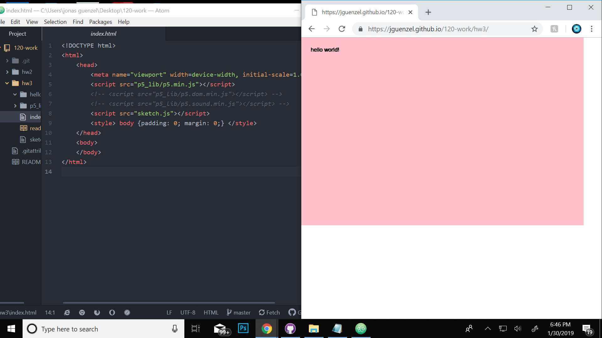

Jonas Guenzel

[live"hello world!"](https://jguenzel.github.io/120-work/hw3/)

1.the biggest challenge that I faced this week was solving why my draw function wasn't working and why it wouldn't write "hello world!" which was solved by fixing a letter that was out of place. Another challenge I faced was my url not working which I solved by renaming the folder and moving the contents.

2.the steps I took to complete this assignment were very straightforward I mostly followed the examples in the tutorials making sure to follow along and making sure that they were correct and accurate.

3.overall this work week was really interesting I learned a lot about being accurate with code and making sure to be concise and triple check my work. I think this helped me with staying on track as well as getting better assignments with my sketch.

4.this week I did learn something that was interesting that I should bring up which is if you place your cursor in between both brackets and press enter it creates a space for you to work in while keeping your lines of code in between the brackets.

5.this week I did not help my classmates with any problems

Current p5 version -> 0.7.1
