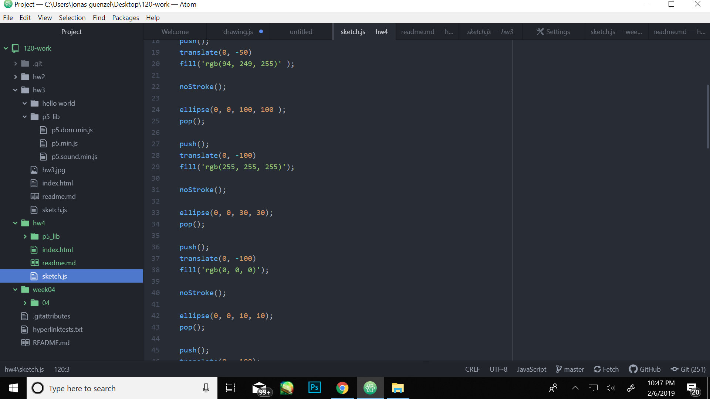

1.what I did this week was learn how to create pictures from shape functions in atom. this week I learned how to rotate functions and scale drawings as well as how to display text to properly title works.

2.the steps I took to complete this weeks assignment was drawing the image on paper so I had a concept to work from, reviewing each function, and making sure that each of the colors would come off as compelling rather than annoying to look at. I also made sure not use any strokes for my drawing so that the colors and the form could stand out.

3.I had no problems this week and managed to get the drawing I wanted, but If I had to say something I struggled with it was the rotate tool but I solved it with carefully looking over the code again.

4.I learned a lot this week but I have nothing that I learned that would be interesting to any one else or beneficial.

5.I did not help anyone in the repo tracker or on the issues forum this week.

Current p5 version -> 0.7.1
